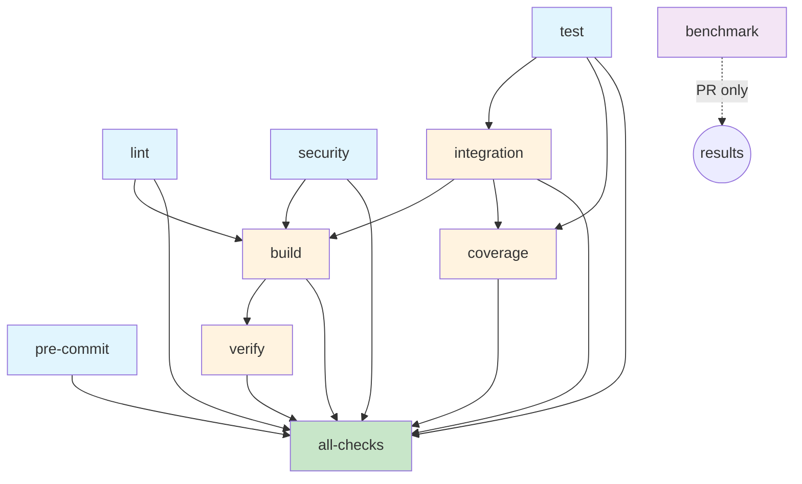

# Continuous Integration (CI)

This document describes the CI pipeline for sortTF, including the workflow structure, job dependencies, and configuration details.

## Table of Contents

- [Overview](#overview)
- [Workflow Triggers](#workflow-triggers)
- [Job Dependency Graph](#job-dependency-graph)
- [Jobs Description](#jobs-description)
- [Required Checks](#required-checks)
- [Branch Protection](#branch-protection)
- [Workflow Configuration](#workflow-configuration)
- [Troubleshooting](#troubleshooting)

## Overview

The CI pipeline is defined in `.github/workflows/ci.yml` and runs automatically on:

- Push to `main` branch
- Pull requests targeting `main` branch
- Manual workflow dispatch

The pipeline ensures code quality, security, and correctness through multiple stages of automated checks.

## Workflow Triggers

```yaml
on:
  push:
    branches: [main]
  pull_request:
    branches: [main]
  workflow_dispatch: # Allow manual triggering
```

**Concurrency Control:**

```yaml
concurrency:
  group: ${{ github.workflow }}-${{ github.ref }}
  cancel-in-progress: true
```

In-progress runs are cancelled when a new workflow with the same group name is triggered, saving CI resources.

## Job Dependency Graph

The CI workflow follows a logical dependency structure to ensure efficient parallel execution while maintaining correctness:



**Execution Flow:**

```text
┌─────────────────────────────────────┐
│ Phase 1: Parallel (no dependencies) │
├─────────────────────────────────────┤
│ • lint                              │
│ • pre-commit                        │
│ • security                          │
│ • test                              │
│ • benchmark (PR only)               │
└─────────────────────────────────────┘
                ↓
        ┌───────────────┐
        │ Phase 2:      │
        │ integration   │
        │ (needs: test) │
        └───────────────┘
                ↓
    ┌──────────────────────────────┐
    │ Phase 3: Parallel            │
    ├──────────────────────────────┤
    │ • build                      │
    │   (needs: lint, security,    │
    │    integration)              │
    │                              │
    │ • coverage                   │
    │   (needs: test, integration) │
    └──────────────────────────────┘
                ↓
        ┌───────────────┐
        │ Phase 4:      │
        │ verify        │
        │ (needs: build)│
        └───────────────┘
                ↓
        ┌───────────────┐
        │ Phase 5:      │
        │ all-checks    │
        │ (needs: all)  │
        └───────────────┘
```

## Jobs Description

### 1. Lint (`lint`)

**Purpose:** Code quality and formatting checks
**Runner:** `ubuntu-latest`
**Dependencies:** None

**Steps:**

- Run `golangci-lint` with comprehensive linters
- Check Go formatting with `gofmt -s`
- Verify `go.mod` and `go.sum` are tidy

**Key Configuration:**

```yaml
- uses: golangci/golangci-lint-action@v9.2.0
  with:
    version: latest
    args: --timeout=5m --verbose
```

### 2. Pre-commit (`pre-commit`)

**Purpose:** Pre-commit hook validation
**Runner:** `ubuntu-latest`
**Dependencies:** None

**Steps:**

- Run all pre-commit hooks on all files
- Validates YAML, Markdown, secrets, etc.
- Skips `golangci-lint` (handled by dedicated lint job)

**Note:** The `golangci-lint` hook is skipped in CI via `SKIP` environment variable since it's covered by the dedicated `lint` job.

### 3. PR Labeler (`labeler`)

**Purpose:** Automatically label pull requests based on changed files
**Runner:** `ubuntu-latest`
**Dependencies:** None
**Condition:** Only runs on pull requests

**Configuration:**

Labels are automatically applied based on file paths defined in `.github/labeler.yml`. Examples:

- `documentation` - Applied when docs or markdown files change
- `api`, `cli`, `hcl-parser` - Applied based on package changes
- `tests`, `integration-tests` - Applied for test file changes
- `ci-cd`, `dependencies` - Applied for CI and dependency changes

**Permissions:**

```yaml
permissions:
  contents: read
  pull-requests: write  # Required to add labels
```

### 4. Security (`security`)

**Purpose:** Security vulnerability scanning
**Runner:** `ubuntu-latest`
**Dependencies:** None

**Steps:**

- Run `gosec` security scanner
- Upload SARIF results to GitHub Code Scanning
- Run `govulncheck` for known vulnerabilities

**SARIF Upload:**

```yaml
- uses: github/codeql-action/upload-sarif@v4
  with:
    sarif_file: results.sarif
```

### 5. Test (`test`)

**Purpose:** Unit tests across multiple platforms
**Runner:** Matrix (ubuntu, macos, windows)
**Dependencies:** None

**Matrix Strategy:**

```yaml
strategy:
  fail-fast: false
  matrix:
    os: [ubuntu-latest, macos-latest, windows-latest]
    go-version: ['1.23.x']
```

**Steps:**

- Run unit tests with race detector and coverage
- Upload coverage to Codecov (Ubuntu only)
- Exclude integration tests (run separately)

**Test Command:**

```bash
go test -race -covermode=atomic -coverprofile=coverage.out -v \
  $(go list ./... | grep -v '/integration$')
```

### 6. Integration (`integration`)

**Purpose:** Integration tests with real binary
**Runner:** `ubuntu-latest`
**Dependencies:** `test`

**Steps:**

- Build `sorttf` binary for integration tests
- Run integration test suite
- Upload integration coverage to Codecov

**Why after `test`?**
Integration tests should only run if unit tests pass to save CI time and resources.

### 7. Build (`build`)

**Purpose:** Build binaries for multiple platforms
**Runner:** Matrix (ubuntu, macos, windows)
**Dependencies:** `lint`, `security`, `integration`

**Build Matrix:**

| OS              | GOOS    | GOARCH | Artifact Name            |
| --------------- | ------- | ------ | ------------------------ |
| ubuntu-latest   | linux   | amd64  | sorttf-linux-amd64       |
| ubuntu-latest   | linux   | arm64  | sorttf-linux-arm64       |
| macos-latest    | darwin  | amd64  | sorttf-darwin-amd64      |
| macos-latest    | darwin  | arm64  | sorttf-darwin-arm64      |
| windows-latest  | windows | amd64  | sorttf-windows-amd64.exe |

**Build Configuration:**

```yaml
env:
  GOOS: ${{ matrix.goos }}
  GOARCH: ${{ matrix.goarch }}
  CGO_ENABLED: 0
run: |
  go build -v -trimpath \
    -ldflags="-s -w -X main.version=${{ github.sha }}" \
    -o ${{ matrix.artifact_name }} ./cmd/sorttf
```

**Artifacts:** Binaries are uploaded with 7-day retention.

### 8. Verify (`verify`)

**Purpose:** Smoke test the built binary
**Runner:** `ubuntu-latest`
**Dependencies:** `build`

**Steps:**

- Download Linux AMD64 binary
- Test `--help` flag
- Run binary on sample Terraform file

**Example Test:**

```bash
echo 'resource "test" "foo" { name = "bar" }' > test.tf
./sorttf-linux-amd64 test.tf
cat test.tf
```

### 9. Benchmark (`benchmark`)

**Purpose:** Performance benchmarking (PR only)
**Runner:** `ubuntu-latest`
**Dependencies:** None
**Condition:** Only runs on pull requests

**Features:**

- Runs Go benchmarks with memory profiling
- Posts results as PR comment
- Updates existing comment (no spam)

**Comment Management:**

The workflow uses an HTML marker to find and update existing benchmark comments:

```javascript
const marker = '<!-- benchmark-results -->';
// Find existing comment with marker
// Update if exists, create if not
```

### 10. Coverage (`coverage`)

**Purpose:** Combined coverage report and threshold check
**Runner:** `ubuntu-latest`
**Dependencies:** `test`, `integration`

**Steps:**

- Generate coverage from unit and integration tests
- Merge coverage files
- Generate HTML coverage report
- Enforce 90% coverage threshold

**Coverage Threshold:**

```bash
COVERAGE=$(go tool cover -func=coverage.out | grep total | awk '{print $3}' | sed 's/%//')
if (( $(echo "$COVERAGE < 90" | bc -l) )); then
  echo "Coverage is below 90%"
  exit 1
fi
```

**Artifact:** HTML coverage report uploaded with 14-day retention.

### 11. All-Checks (`all-checks`)

**Purpose:** Final status check for branch protection
**Runner:** `ubuntu-latest`
**Dependencies:** All critical jobs
**Condition:** Always runs (even if others fail)

**Required Jobs:**

- `lint`
- `pre-commit`
- `security`
- `test`
- `integration`
- `build`
- `verify`
- `coverage`

This job is used for branch protection rules to ensure all critical checks pass before merging.

## Required Checks

For branch protection, configure the following required status checks:

1. **All Checks Passed** - The `all-checks` job (recommended)
2. Individual checks (alternative):
   - Lint
   - Pre-commit
   - Security Scan
   - Test (all matrix combinations)
   - Integration Tests
   - Build (all matrix combinations)
   - Verify Binary
   - Coverage Report

**Recommendation:** Use only the `all-checks` job as a required check for simplicity.

## Branch Protection

Recommended branch protection settings for `main`:

```yaml
# .github/branch-protection.yml (example)
main:
  required_status_checks:
    strict: true
    contexts:
      - "All Checks Passed"
  required_pull_request_reviews:
    required_approving_review_count: 1
  enforce_admins: true
  restrictions: null
```

## Workflow Configuration

### Environment Variables

```yaml
env:
  GO_VERSION: '1.23.10'
```

Update the Go version here to change it across all jobs.

### Permissions

Most jobs use default permissions. Special permissions:

**Benchmark job:**

```yaml
permissions:
  contents: read
  pull-requests: write  # For commenting
```

**Security job:**

```yaml
permissions:
  security-events: write  # For SARIF upload
```

### Caching

Go module caching is enabled for all jobs:

```yaml
- uses: actions/setup-go@v6
  with:
    go-version: ${{ env.GO_VERSION }}
    cache: true  # Caches Go modules
```

### Timeout

Default timeout for workflows is 6 hours. Individual jobs may have custom timeouts:

- Integration tests: 10 minutes timeout

## Troubleshooting

### Common Issues

#### 1. Lint Job Fails

**Problem:** golangci-lint reports issues
**Solution:**

```bash
# Run locally
golangci-lint run --timeout=5m --verbose

# Auto-fix issues
golangci-lint run --fix
```

#### 2. Pre-commit Job Fails

**Problem:** Pre-commit hooks fail in CI
**Solution:**

```bash
# Run locally
pre-commit run --all-files

# Install hooks
pre-commit install
```

#### 3. Coverage Below Threshold

**Problem:** Coverage drops below 90%
**Solution:**

- Add tests for uncovered code
- Check coverage locally:

```bash
go test -coverprofile=coverage.out ./...
go tool cover -html=coverage.out
```

#### 4. Build Job Fails - `cmd/sorttf` not found

**Problem:** `.gitignore` accidentally ignoring source files
**Solution:**

- Check `.gitignore` patterns
- Ensure `/sorttf` not `sorttf` (which matches directory)

```gitignore
# Good
/sorttf
sorttf-*

# Bad
sorttf  # Matches cmd/sorttf directory!
```

#### 6. Integration Tests Fail - Binary Not Built

**Problem:** Binary path resolution in `TestMain`
**Solution:**

The integration tests automatically find the repo root and build the binary. Check the `findRepoRoot()` function in `integration/integration_test.go`.

### Debugging Tips

1. **Enable debug logging:**

```yaml
- name: Run tests
  env:
    ACTIONS_STEP_DEBUG: true
  run: go test -v ./...
```

1. **Check artifact uploads:**

   - Download artifacts from GitHub Actions UI
   - Verify binary is executable and works

1. **Test matrix failures:**

   - Check which OS/Go version combination failed
   - Run tests locally on that platform

1. **SARIF upload issues:**

   - Check gosec output format
   - Verify security events permission

### Re-running Workflows

**Re-run failed jobs only:**

- Click "Re-run failed jobs" in GitHub Actions UI

**Re-run entire workflow:**

- Click "Re-run all jobs"
- Or trigger via workflow dispatch

**Trigger manually:**

```bash
gh workflow run ci.yml
```

## Performance Optimization

### Parallel Execution

The workflow maximizes parallelism:

- Phase 1: 5 jobs run in parallel (lint, pre-commit, security, test, benchmark)
- Phase 3: 2 jobs run in parallel (build, coverage)

### Cache Usage

- Go module cache persists between runs
- Pre-commit hook cache (automatic)

### Matrix Optimization

Build matrix runs in parallel across different runners, significantly reducing total build time.

## Security Considerations

### Secrets

No secrets are required for the standard workflow. For external integrations:

- `CODECOV_TOKEN` - Optional, auto-detected for public repos
- `GITHUB_TOKEN` - Automatically provided

### SARIF Upload

Security scan results are uploaded to GitHub Security tab for:

- Vulnerability tracking
- Code scanning alerts
- Security insights

### Dependency Security

- `govulncheck` scans for known vulnerabilities in dependencies
- Automatic security updates via Dependabot (if configured)

## Best Practices

1. **Always run tests locally before pushing:**

   ```bash
   go test ./...
   golangci-lint run
   pre-commit run --all-files
   ```

2. **Keep Go version updated:**

   - Update `GO_VERSION` in `ci.yml`
   - Update `go.mod` minimum version

3. **Monitor CI performance:**

   - Review workflow run times
   - Optimize slow tests
   - Consider parallelizing long-running tests

4. **Maintain coverage threshold:**

   - Add tests when adding features
   - Don't decrease coverage requirement

5. **Review benchmark results:**
   - Check for performance regressions
   - Compare against baseline

## Related Documentation

- [CONTRIBUTING.md](CONTRIBUTING.md) - Contribution guidelines
- [DEVELOPMENT.md](DEVELOPMENT.md) - Development setup
- [RELEASING.md](RELEASING.md) - Release process
- [ARCHITECTURE.md](ARCHITECTURE.md) - Code architecture

## Updates and Maintenance

### Updating GitHub Actions

Actions are pinned to specific SHAs for security:

```yaml
uses: actions/checkout@de0fac2e4500dabe0009e67214ff5f5447ce83dd # v6.0.2
```

To update:

1. Check for new versions
2. Update SHA and version comment
3. Test thoroughly

### Adding New Checks

When adding new jobs:

1. Determine appropriate dependencies
2. Update `all-checks` job `needs` list
3. Update this documentation
4. Test on a PR before merging

## Continuous Improvement

The CI pipeline is continuously improved. Suggestions welcome via:

- GitHub Issues
- Pull Requests
- Discussions

---

For questions or issues with the CI pipeline, please open an issue on GitHub.
